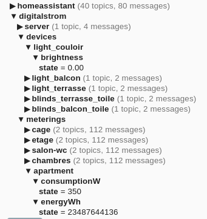

# DigitalSTROM MQTT

This application allows you to set and react to any DigitalSTROM devices using MQTT.

You can set the output values using the command topic and get the current value using the state topic.



## Motivation

[DigitalSTROM](https://www.digitalstrom.com/en/) system is built upon scenes. You press a button, and a scene starts.
The scene can trigger as many output devices as you want. While this is fine for a standalone system, it’s really
difficult to integrate with a more complex automation system. Basically, if you want the master of your automation to be
an external system, you will have a bad time.

DigitalSTROM provides a REST api, but it’s not that easy to use since there are a lot of different concepts (scenes,
groups, areas, …). There is also an event endpoint, so you can react to some events. Unfortunately it’s pretty limited (
for example you don’t have an event when a device output is changed).

Currently, digitalSTROM integrations with home automation systems are rare and sometimes limited. The intent of this app is
to solve this issue as all of them support MQTT.

## Concept

The main goal of this application is to have direct access to the output devices (light, blinds,...) and be notified
when something changes. All of this using MQTT as it’s widely used in home automation systems.

This application will not reflect the internal functioning of digitalSTROM. It will rather try to make an abstraction of
it.

### Technical

This app use the `json/device/` api to set the values, `json/property` to get the cached output value (digitalSTROM
takes 1-2s per call if you ask the actual value from the device) and `json/event/` to be notified when a scene change.

Since we don’t have an event when an output value changes we have to work around this limitation. Any push of a button (
for example) will trigger a scene. DigitalSTROM provides an event when a scene is called. We can then get the state of
the devices in this scene. This overfetch a bit too much data (since we ask for all devices in a zone) but narrows the
update state request, so we don’t have to ask for all the devices in the system.

## Configuration

You have two ways of configuring the app. Either using a `config.yaml` file next to the executable or with environment
variables.

| required | property | description | default | example |
| --- | --- | --- | --- | --- |
| * | DIGITALSTROM_HOST | Ip address of the digitalstrom system |  | 192.168.1.10 |
|   | DIGITALSTROM_PORT | Secure port of the rest API | 8080  | |
| * | DIGITALSTROM_USERNAME | Username for digitalstrom | | dssadmin |
| * | DIGITALSTROM_PASSWORD | Password for digitalstrom | | 9TyVg74e5S |
| * | MQTT_URL | MQTT url | | tcp://192.168.1.20:1883 |
|   | MQTT_USERNAME | MQTT username |  | myUser |
|   | MQTT_PASSWORD | MQTT password |  | 9TyVg74e5S |
|   | MQTT_TOPIC_FORMAT | Topic format | digitalstrom/{deviceType}/{deviceName}/{channel}/{commandState} | |
|   | MQTT_NORMALIZE_DEVICE_NAME | Remove special chars from device name | true | |
|   | MQTT_RETAIN | Retain MQTT messages | false | |
|   | REFRESH_AT_START | should the states be refreshed at start | true | |
|   | LOG_LEVEL | log level | INFO | TRACE,DEBUG,INFO,WARN,ERROR |
|   | INVERT_BLINDS_POSITION | 100% is fully close | false |  |

## Minimal config file

config.yaml

```yaml
DIGITALSTROM_HOST: 192.168.1.x
DIGITALSTROM_USERNAME: dssadmin
DIGITALSTROM_PASSWORD: XXX
MQTT_URL: tcp://192.168.1.X:1883
```

### MQTT topic format variable

Those are the variable available for the configuration `MQTT_TOPIC_FORMAT`.

| variable | description | example |
| --- | --- | --- |
| {deviceType} |  | `circuit` or `device` |
| {deviceName} | Device or Circuit name | `light_bathroom` |
| {deviceId} | Dsid of the device | `302de89f43f00e40000120b3` |
| {channel} | DS channel |  |
| {commandState} |  | `command` or `state` |

## How to run

### Using the binary

Go to [Releases](https://github.com/gaetancollaud/digitalstrom-mqtt/releases), download and unzip the latest version for
your OS. Create the config file as shown above.

Start the executable

```shell
./digitalstrom-mqtt
```

### Using docker

```shell
docker run \
  -e DIGITALSTROM_HOST=192.168.1.x \
  -e DIGITALSTROM_USERNAME=dssadmin \
  -e DIGITALSTROM_PASSWORD=XXX \
  -e MQTT_URL=tcp://192.168.1.X:1883 \
  gaetancollaud/digitalstrom-mqtt
```

### MQTT-Explorer

We recommend using https://mqtt-explorer.com/ if you want a simple interface for MQTT.

## Topics

### GE devices (lights)

```
digitalstrom/devices/DEVICE_NAME/brightness/state
digitalstrom/devices/DEVICE_NAME/brightness/command
```

### GR devices (blinds)

```
digitalstrom/devices/DEVICE_NAME/shadePositionOutside/state
digitalstrom/devices/DEVICE_NAME/shadePositionOutside/command
digitalstrom/devices/DEVICE_NAME/shadeOpeningAngleOutside/state
digitalstrom/devices/DEVICE_NAME/shadeOpeningAngleOutside/command
```

### dSS20 (circuits)

```
digitalstrom/circuits/chambres/consumptionW/state
digitalstrom/circuits/chambres/EnergyWs/state
```

## Tested devices

digitalSTROM-MQTT was tested successfully with these devices:

* dSM12
* dSS20
* GE-KM200
* GE-TKM210
* SW-TKM200
* SW-TKM210
* GR-KL200
* GR-KL210
* GR-KL220
* GN-KM200 (see [#21](https://github.com/gaetancollaud/digitalstrom-mqtt/issues/21))

Some devices are known to have issues or limitations:

* BL-KM300 (see [#7](https://github.com/gaetancollaud/digitalstrom-mqtt/issues/7) [#19](https://github.com/gaetancollaud/digitalstrom-mqtt/issues/19))
* GE-UMv200 (see [#22](https://github.com/gaetancollaud/digitalstrom-mqtt/issues/22))

Feel free to create an issue or to directly edit this file if you have tested this software with your devices.

## Development

See [CONTRIBUTION.md](./CONTRIBUTION.md)
